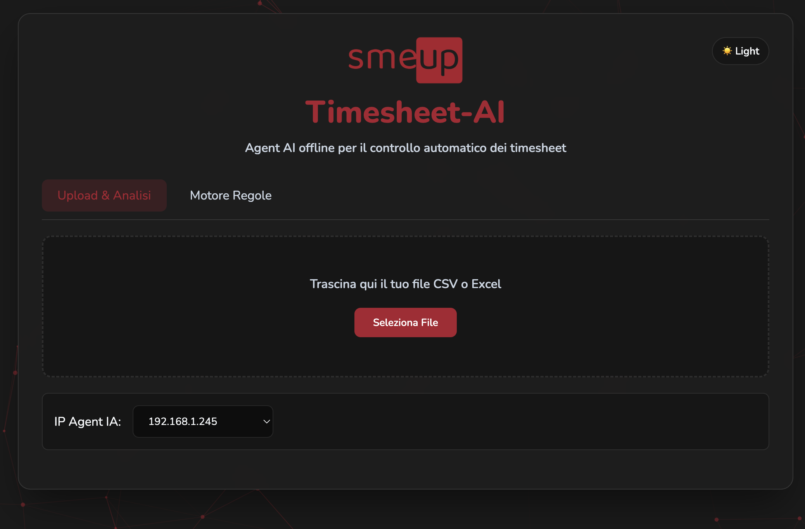
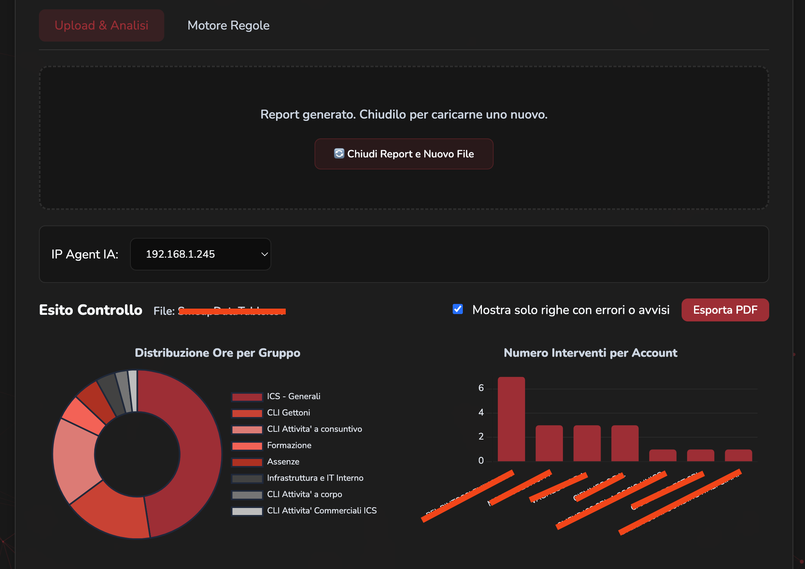
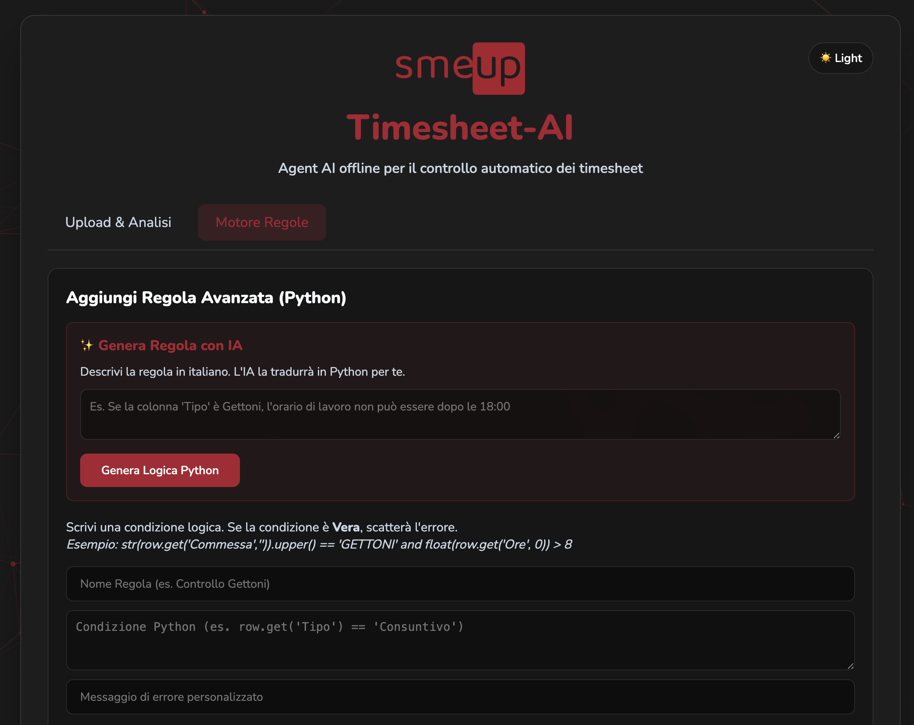

# Timesheet-AI 🔴

**Agent AI offline per il controllo automatico dei timesheet aziendali.**

Sviluppato per **Smeup** — Sistema basato su Google Gemma 2 (2B) tramite Ollama, completamente locale e senza invio di dati all'esterno.

---

## 📸 Screenshots

| Upload & Analisi | Dashboard Risultati | Motore Regole |
|:---:|:---:|:---:|
|  |  |  |
| *Home page di caricamento* | *Risultati, Bande Rosse e Chart.js* | *Generatore regole con AI* |

---

## 🚀 NOVITÀ Versione 2.0: Dashboard Manageriale
L'applicazione non si limita più al controllo degli errori, ma offre statistiche in tempo reale:
- **Grafico a Torta (Gruppi):** Mostra la percentuale di ore impiegate per ogni *Gruppo Timesheet*.
- **Grafico a Barre (Clienti):** Mostra il numero di interventi totali per ogni *Account* o Cliente.
- **Supporto PDF:** La dashboard interattiva viene automaticamente stampata in prima pagina nell'export PDF!

---

## Funzionalità

- 📂 **Upload CSV/Excel** — Caricamento file con rilevamento automatico dell'encoding
- 🧠 **Motore Regole V2 (Cross-Row)** — Le regole possono aggregare dati su più righe (es. ore mensili)
- 🛡️ **Parser Intelligente** — La funzione `safe_float()` converte "3,5" in 3.5 e ignora celle vuote senza crash
- 🔴 **Bande di Errore** — Visualizzazione degli errori come bande rosse sopra le righe errate
- ✨ **Animazione Magica** — Animazione con stelle durante l'elaborazione AI
- 🤖 **Generatore Regole IA** — Descrivi la regola in italiano, l'AI genera il codice Python
- ⚡ **Toggle Regole** — Attiva/disattiva le regole senza eliminarle
- ✏️ **Editing Regole** — Modifica le regole esistenti al volo
- 🌗 **Dark/Light Mode** — Tema chiaro e scuro con memoria nel browser
- 📄 **Export PDF** — Genera un report PDF del controllo in un click
- 🌐 **IP Intelligente** — Ricorda l'ultimo IP dell'agente AI usato

---

## Stack Tecnologico

| Componente | Tecnologia |
|---|---|
| Backend | FastAPI (Python) |
| AI Engine | Google Gemma 2 (2B) via Ollama |
| Database | SQLite |
| Frontend | HTML, CSS (Vanilla), JavaScript |
| Font | Nunito (Google Fonts) |
| Particelle | tsParticles |
| Export PDF | html2pdf.js |

---

## Requisiti Hardware & Software (Server/VM)

- **OS:** Linux (Ubuntu Server consigliato)
- **CPU:** Minimo 4 vCPU (8 vCPU consigliate per ridurre i tempi di inferenza dell'IA senza GPU dedicata)
- **RAM:** 8–12 GB consigliati
- **Disco:** ~20 GB di spazio libero (necessari per OS, librerie Python e pesi del modello LLM)
- **Rete:** IP statico per la VM e Reverse Proxy opzionale sulla porta 8000
- **Software:** Python 3.10+ e [Ollama](https://ollama.com/) installato con il modello `gemma2:2b`

---

## Installazione

```bash
# Clona il repository
git clone https://github.com/mantovanellimatteo/timesheet-ai.git
cd timesheet-ai

# Crea e attiva l'ambiente virtuale
python3 -m venv venv
source venv/bin/activate  # Su Windows: venv\Scripts\activate

# Installa le dipendenze
pip install fastapi uvicorn pandas openpyxl requests python-multipart

# Avvia il server
uvicorn main:app --host 0.0.0.0 --port 8000 --reload
```

Apri il browser su `http://localhost:8000`

---

## Configurazione Ollama

```bash
# Installa Ollama (Linux)
curl -fsSL https://ollama.com/install.sh | sh

# Scarica il modello Gemma 2
ollama pull gemma2:2b

# Avvia il server Ollama
ollama serve
```

---

## Struttura del Progetto

```
timesheet-ai/
├── main.py              # Backend FastAPI
├── static/
│   ├── index.html       # Interfaccia utente
│   ├── styles.css       # Stili (tema Smeup)
│   ├── script.js        # Logica frontend
│   └── logo.png         # Logo aziendale
└── README.md
```

---

## Come usare il Motore Regole V2

Le regole si basano su espressioni Python. Hai a disposizione:
- `row`: la singola riga analizzata (Dizionario)
- `rows`: tutte le righe del documento (Lista di Dizionari, utile per il cross-row)
- `safe_float(val)`: funzione per convertire numeri con la virgola (2,5) ed evitare crash su celle vuote.

**Esempio 1 — Singola Riga (Gettoni errati):**
```python
str(row.get('Gruppo Timesheet', '')).strip().upper() == 'CLI GETTONI' and safe_float(row.get('Ore')) % 0.25 != 0
```

**Esempio 2 — Regola Multi-Riga (Somma giornaliera):**
Se le ore totali di una persona in un giorno superano le 8 ore:
```python
sum(safe_float(r.get('Ore')) for r in rows if r.get('Data', '') == row.get('Data', '') and r.get('Utente', '') == row.get('Utente', '')) > 8
```

Oppure usa il **Generatore IA** integrato: descrivi la regola in italiano (anche complessa e multi-riga) e Gemma 2 scriverà il codice Python per te!

---

## Licenza

Uso interno aziendale — Smeup SpA
